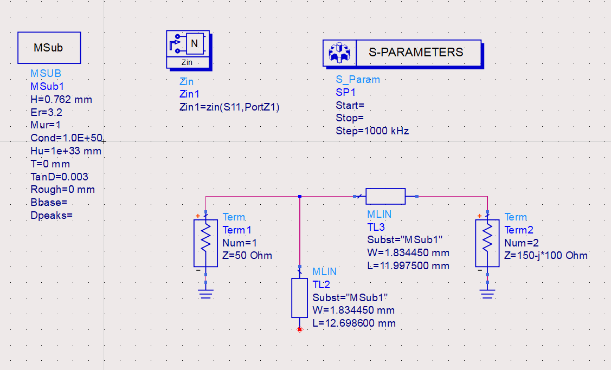

# ERF Relatorio 19 Out

## Abstrato
Este trabalho tem como objetivo estudar a utilização de _impedance matching_ numa linha de transmissão. A principal vantagem de realizar este processo é que garante uma redução de reflexões em ambos os portos da linha, na frequência de operação. 
$$R_L = R_S$$
$$P_{max}=\frac{V^2}{R_S}\frac{R_L/R_S}{(1+R_L/R_S)^2)}$$
Ambos os stubs, em aberto e em curto, podem ser usados para esta análise. Sabendo que stubs abertos podem comportar-se como antenas para frequências muito elevadas, iremos usar stubs em aberto. Numa primeira fase, iremos apenas configurar um stub, uma abordagem mais rápida mas menos versátil. Para um maior controlo e precisão, numa segunda fase, vamos configurar a linha de transmissão com dois stubs.

## 1 a) Single Open Stub
Os stubs podem ser usados para combinar a impedância de carga com a impedância da fonte. O stub é posicionado a uma certa distância da carga, para que a parte resistiva da sua impedância seja igual à parte resistiva da impedância da fonte. O comprimento do stub é escolhido de forma a que a parte reativa entre as duas seja, também, cancelada. Um stub é usado para uma combinação perfeita numa única frequência.
Para tal conectamos duas _microstrip lines_ ligadas entre a carga e a fonte, bem como outra ligada apenas à fonte e com o outro terminal desconectado , para simular o _open Stub_. Posteriormente dimensionamos ambas as _microstrip lines_ com auxilio da ferramenta de _Smith Chart_ para obter a impedância da linha e do stub que correspodem a zero reflexões e zero perdas das linhas. Normalizando os valores da impedância, obtivemos duas soluções: A primeira com o caminho mais longo de stub e a segunda com o mais curto.

__Stub Longo__:
{ width=45% } { width=45% }

__Stub Curto__:
{ width=45% } { width=45% }

Para estas análises, com os valores que obtivemos em cima subtituímos na ferramente _LineCalc_ para obtermos os valores físicos das _Microstrip lines_. Segue abaixo as imagens correspondentes aos esquemas finais.

{ width=45% } 

{ width=45% }

Após isto, analisamos os gráficos para identificar a solução ótima. Concluimos que os coeficientes de reflexão de ambas as soluções são idênticos, obtendo aquilo que era esperado. Nas frequências de que não a de operação o coeficiente de reflexão situa-se perto de zero e na frequência de operação (2,4GHz) um pico negativo. A diferença mais observável é na impedância de entrada, que se encontra invertida nas duas imagens.

{ width=45% } 

{ width=45% }

## b)  Douple Open Stubs
Executamos os mesmo passos anteriormente para acomodarmos dois stubs no nosso esquema. Em modos gerais usar dois stubs é um técnica mais comum, isto porque, usando apenas um stub se a carga mudar a posição e comprimento do stub tem de mudar também. Usando dois stubs é possível fixar a posição dos stubs em relação um ao outro e apenas mudar o comprimento dos stubs para dar _match_ a uma variação da carga.

{ width=45% } 

{ width=45% }

{ width=45% }

{ width=45% } 

{ width=45% }

{ width=45% } 

## 2. Optional assignment

Efetuamos a Simulação Electromagnética do esquema de 1.a). No primeiros gráfico conseguimos observar os resultados da simulação electromagnética de todos os _S parameters_ Comparando os resultados da análise electromagnética baseado no Método dos Momentos com a análise inicial, podemos verificar uma deslocação da frequência aonde a reflexão é nula. A análise electromagnética baseada no metódo dos momentos é esperado que nos dê um simulação mais precisa que a simulação inicial, que numa primeira fase, a simulação esquemática é mais rápida.

{ width=45% }

{ width=45% }

{ width=45% }

# Conlusions

Em suma, numa primeira fase usar apenas um _stub_ para equilibrar a linha é uma abordagem mais rápida para obter a solução desejada. Para uma maior versatilidade com o mesmo objetivo podemos usar dois _stubs_ em aberto, deste modo não temos de alterar a distância e o comprimento do stub, apenas temos de variar o comprimento dos stubs, caso mude a impedância de carga, mantência a distância relativa entre os mesmos. Um _stub_ só vai atingir uma perfeita combinação numa só frequência, usando vários _stubs_ já conseguimos obter uma combinação perfeita numa maior gama de frequências. A simulação electromagnética baseada no Método dos Momentos é mais trabalhosa e demorada mas permite obter uma simulação mais precisa.
