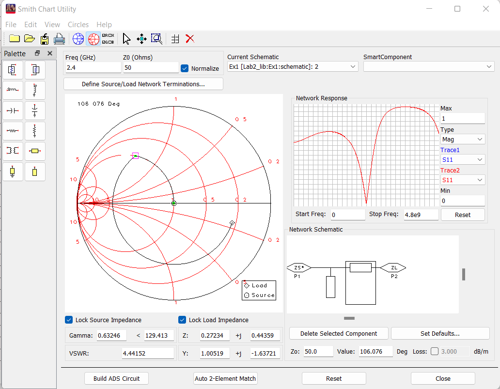
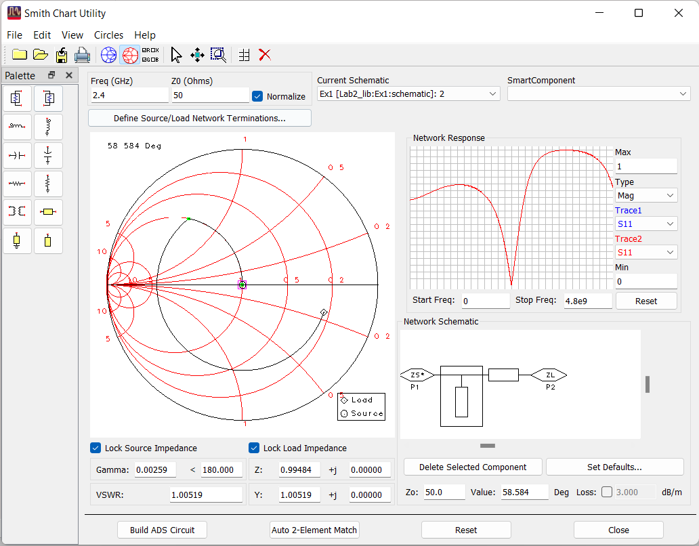
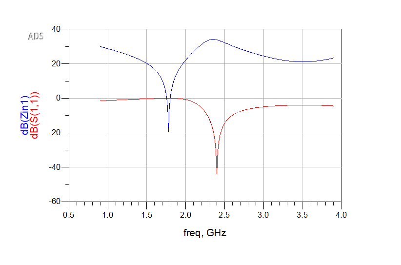
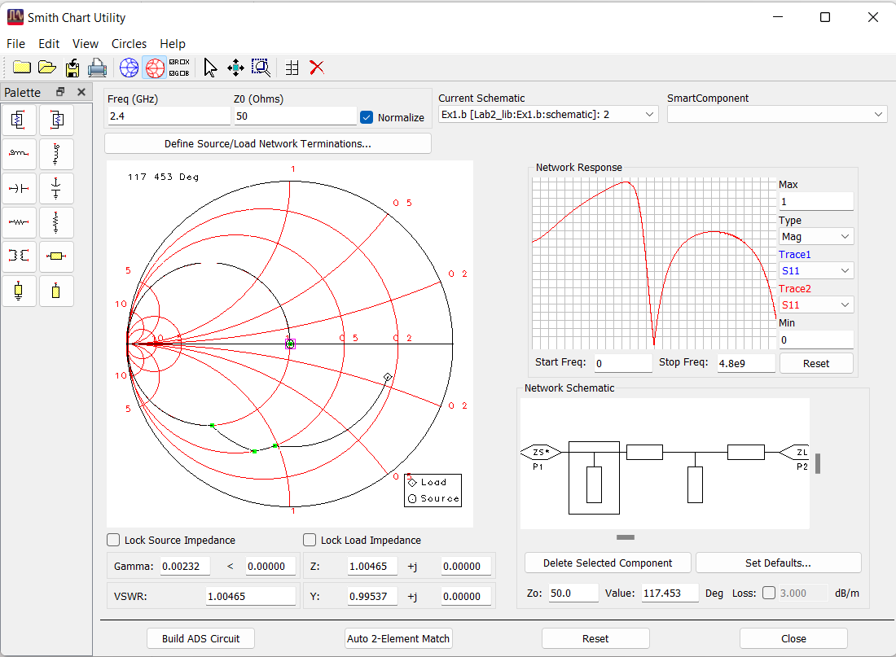
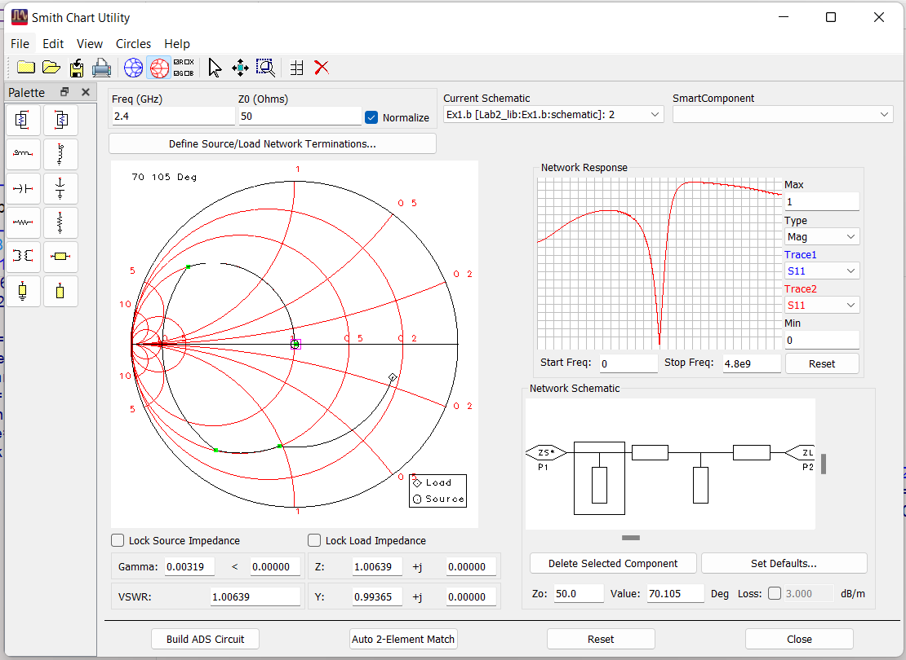

---
title: "Relatórtio Laboratório 1 ERF"
author: [José Pedro Cruz, Martinho Figueiredo]
date: "19-10-22"
keywords: [Markdown, Example]
titlepage: true
float-placement-figure: h
...

# ERF Relatorio 19 Out
>Martinho Figueiredo (up201506179)
>
>José Pedro Cruz (up201504646)

## Abstrato
Este trabalho tem como objetivo praticar o equilibrio de impedâncias entre a carga e a linha de forma da não existiram distorções no sinal. O principal objetivo é conectar uma impedância de valor complexo (_150 - j100_)arbitrário a uma fonte com uma impedância da fonte de carga (_50 _) sem que haja reflexão da entrada e para garantir potência máxima de transferência entre a fonte e a carga. 
$$R_L = R_S$$
$$P_{max}=\frac{V^2}{R_S}\frac{R_L/R_S}{(1+R_L/R_S)^2)}$$
Ambos stubs em aberto e em curto podem ser usados para esta análise, neste caso iremos usar stubs em aberto. Numa primeira fase iremos posicionar apenas um stub, uma abordagem mais rápida, mas menos versátil. E para uma maior versatilidade, numa segunda fase, posicionar dois stubs.

# 1
## a) Single Open Stub
Os stubs podem ser usados para combinar a impedância de carga com a impedância da fonte. O stub é posicionado a uma certa distancia da carga para que a parte resistiva da impedância da carga seja igual à parte resistiva da impedãncia da fonte. O comprimento do stub é escolhido de forma a que a parte reativa entre as duas seja, também, cancelada. Um stub é usado para uma combinação perfeita numa única frequência.
Para tal posiciona-mos duas _microstrip lines_ ligadas entre a carga e a fonte e outra entre a fonte e o circuito em aberto, para simular o _open Stub_. Postreriormente dimensionamos ambas as _microstrip lines_ com auxlio da ferramenta de _Smith Chart_ para obter a impedância da linha e do stub que correspodem a zero distorção e zero perdas das linhas. Normalizando os valores da impedância, obtivemos duas soluções: A primeira com o caminho mais longo de stub e a segunda com o mais curto.

__Stub Longo__:

{ width=45% } { width=45% }
__Stub Curto__:

{ width=45% }

{ width=45% }

Para estas análises, com os valores que obtivemos em cima subtituímos na ferramente _LineCalc_ para obtermos os valores físicos das _Microstrip lines_. Segue abaixo as imagens correspondentes aos esquemáticos finais.

Após isto analisamos os gráficos para concluir a solução mais ótima. Concluimos que os coeficientes de reflexão de ambas as soluções são idênticos, obtendo aquilo que era esperado. Nas frequências de que não a de operação o coeficiente de reflexão situa-se perto de zero e na frequência de operação (2,4GHz) um pico negativo. A diferenção mais obervervável é na impedancia de entrada, que se encontra invertida nas duas imagens

## b)  Douple Open Stubs
Executamos os mesmo passos anteriormente para acomodarmos dois stubs no nosso esquemático. Em modos gerais usar dois stubs é um técnica mais comum, isto porque, usando apenas um stub se a carga mudar a posição e comprimento do stub tem de mudar também. Usando dois stubs é possível fixar a posição dos stubs em relação um ao outro e apenas mudar o comprimento dos stubs para dar _match_ a uma variação da carga.

# 2. Optional assignment

Efetuamos a Simulação Electromagnética do esquemático de 1.a). No primeiros gráfico conseguimos observar os resultados da simulação electromagnética de todos os _S parameters_ Comparando os resultados da análise electromagnética baseado no Método dos Momentos com a análise inicial, podemos verificar uma deslocação da frequência aonde a reflexão é nula. A análise electromagnética baseada no metódo dos momentos é esperado que nos dê um simulação mais precisa que a simulação inicial, que numa primeira fase, a simulação esquemática é mais rápida.

# Conlusions

Em suma, numa primeira fase usar apenas um _stub_ para equilibrar a linha é uma abordagem mais rápida para obter a solução desejada. Para uma maior versatilidade com o mesmo objetivo podemos usar dois _stubs_ em aberto, deste modo não temos de alterar a distância e o comprimento do stub, apenas temos de variar o comprimento dos stubs, caso mude a impedância de carga, mantência a distância relativa entre os mesmos. Um _stub_ só vai atingir uma perfeita combinação numa só frequência, usando vários _stubs_ já conseguimos obter uma combinação perfeita numa maior gama de frequências. A simulação electromagnética baseada no Método dos Momentos é mais trabalhosa e demorada mas permite obter uma simulação mais precisa.
