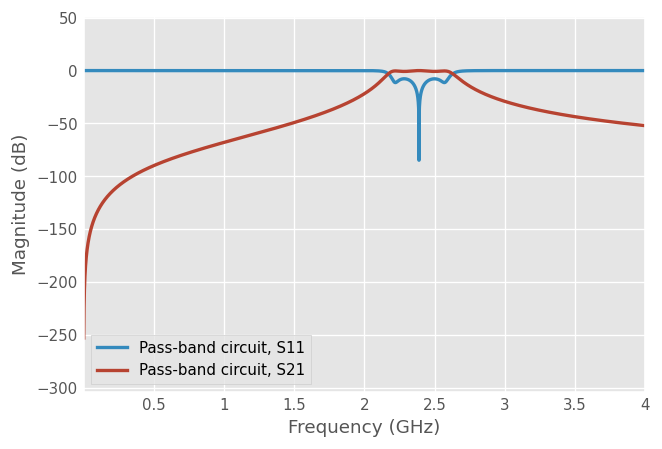

---
title: "Relatórtio Laboratório 5 ERF"
author: [José Pedro Cruz, Martinho Figueiredo]
date: "19-10-22"
keywords: [Markdown, Example]
titlepage: true
float-placement-figure: H
lang: pt
...

# Laboratorio ERF

>Trabalho Prático n.º 5

## Projecto de um filtro passa-banda

>[!question]1. Projecte um filtro passa-banda com as seguintes características:
>- Impedância característica $Z_0=50 \Omega$.
>- Banda $L$ ou $S$ (com largura de banda inferior a 20%).
>- $20\ dB$ de atenuação a 15% da frequência central $f_c$.
>- Perdas por inserção inferiores a $3\ dB$.
>- __Laminado__: Rogers, RO4003C ($H=0.508mm$,$\epsilon_r=3.55$, $tan_D=0.0021$)


>[!question]a) Escolha um tipo de filtro (equal-ripple, maximally flat ou maximally flat time delay) justificando com uma possível aplicação prática para o filtro projectado.

> IEEE Convention
>
> - $L$ band - $[1,2[\ Ghz$
>
> - $S$ band - $[2,4[\ Ghz$
 

A banda S contém o espectro do sinal de Wifi, por isso para ter um objectivo pratico, vamos tentar criar um filtro para wifi 2.4ghz.

Como queremos uma atenuação de 20Db


```python
%pip install scikit-rf
%pip install matplotlib
%pip install networkx
%pip install control
```

    Defaulting to user installation because normal site-packages is not writeable
    Requirement already satisfied: scikit-rf in /home/martinhofigueiredo/.local/lib/python3.10/site-packages (0.24.1)
    Requirement already satisfied: pandas~=1.1 in /home/martinhofigueiredo/.local/lib/python3.10/site-packages (from scikit-rf) (1.5.1)
    Requirement already satisfied: scipy~=1.7 in /home/martinhofigueiredo/.local/lib/python3.10/site-packages (from scikit-rf) (1.9.3)
    Requirement already satisfied: numpy~=1.21 in /home/martinhofigueiredo/.local/lib/python3.10/site-packages (from scikit-rf) (1.23.3)
    Requirement already satisfied: python-dateutil>=2.8.1 in /home/martinhofigueiredo/.local/lib/python3.10/site-packages (from pandas~=1.1->scikit-rf) (2.8.2)
    Requirement already satisfied: pytz>=2020.1 in /home/martinhofigueiredo/.local/lib/python3.10/site-packages (from pandas~=1.1->scikit-rf) (2022.5)
    Requirement already satisfied: six>=1.5 in /home/martinhofigueiredo/.local/lib/python3.10/site-packages (from python-dateutil>=2.8.1->pandas~=1.1->scikit-rf) (1.16.0)
    Note: you may need to restart the kernel to use updated packages.
    Defaulting to user installation because normal site-packages is not writeable
    Requirement already satisfied: matplotlib in /home/martinhofigueiredo/.local/lib/python3.10/site-packages (3.6.2)
    Requirement already satisfied: numpy>=1.19 in /home/martinhofigueiredo/.local/lib/python3.10/site-packages (from matplotlib) (1.23.3)
    Requirement already satisfied: cycler>=0.10 in /home/martinhofigueiredo/.local/lib/python3.10/site-packages (from matplotlib) (0.11.0)
    Requirement already satisfied: packaging>=20.0 in /home/martinhofigueiredo/.local/lib/python3.10/site-packages (from matplotlib) (21.3)
    Requirement already satisfied: python-dateutil>=2.7 in /home/martinhofigueiredo/.local/lib/python3.10/site-packages (from matplotlib) (2.8.2)
    Requirement already satisfied: pillow>=6.2.0 in /usr/lib/python3/dist-packages (from matplotlib) (9.0.1)
    Requirement already satisfied: pyparsing>=2.2.1 in /home/martinhofigueiredo/.local/lib/python3.10/site-packages (from matplotlib) (3.0.9)
    Requirement already satisfied: kiwisolver>=1.0.1 in /home/martinhofigueiredo/.local/lib/python3.10/site-packages (from matplotlib) (1.4.4)
    Requirement already satisfied: fonttools>=4.22.0 in /home/martinhofigueiredo/.local/lib/python3.10/site-packages (from matplotlib) (4.38.0)
    Requirement already satisfied: contourpy>=1.0.1 in /home/martinhofigueiredo/.local/lib/python3.10/site-packages (from matplotlib) (1.0.6)
    Requirement already satisfied: six>=1.5 in /home/martinhofigueiredo/.local/lib/python3.10/site-packages (from python-dateutil>=2.7->matplotlib) (1.16.0)
    Note: you may need to restart the kernel to use updated packages.
    Defaulting to user installation because normal site-packages is not writeable
    Requirement already satisfied: networkx in /home/martinhofigueiredo/.local/lib/python3.10/site-packages (2.8.8)
    Note: you may need to restart the kernel to use updated packages.
    Defaulting to user installation because normal site-packages is not writeable
    Requirement already satisfied: control in /home/martinhofigueiredo/.local/lib/python3.10/site-packages (0.9.2)
    Requirement already satisfied: numpy in /home/martinhofigueiredo/.local/lib/python3.10/site-packages (from control) (1.23.3)
    Requirement already satisfied: scipy in /home/martinhofigueiredo/.local/lib/python3.10/site-packages (from control) (1.9.3)
    Requirement already satisfied: matplotlib in /home/martinhofigueiredo/.local/lib/python3.10/site-packages (from control) (3.6.2)
    Requirement already satisfied: pyparsing>=2.2.1 in /home/martinhofigueiredo/.local/lib/python3.10/site-packages (from matplotlib->control) (3.0.9)
    Requirement already satisfied: python-dateutil>=2.7 in /home/martinhofigueiredo/.local/lib/python3.10/site-packages (from matplotlib->control) (2.8.2)
    Requirement already satisfied: contourpy>=1.0.1 in /home/martinhofigueiredo/.local/lib/python3.10/site-packages (from matplotlib->control) (1.0.6)
    Requirement already satisfied: kiwisolver>=1.0.1 in /home/martinhofigueiredo/.local/lib/python3.10/site-packages (from matplotlib->control) (1.4.4)
    Requirement already satisfied: fonttools>=4.22.0 in /home/martinhofigueiredo/.local/lib/python3.10/site-packages (from matplotlib->control) (4.38.0)
    Requirement already satisfied: pillow>=6.2.0 in /usr/lib/python3/dist-packages (from matplotlib->control) (9.0.1)
    Requirement already satisfied: packaging>=20.0 in /home/martinhofigueiredo/.local/lib/python3.10/site-packages (from matplotlib->control) (21.3)
    Requirement already satisfied: cycler>=0.10 in /home/martinhofigueiredo/.local/lib/python3.10/site-packages (from matplotlib->control) (0.11.0)
    Requirement already satisfied: six>=1.5 in /home/martinhofigueiredo/.local/lib/python3.10/site-packages (from python-dateutil>=2.7->matplotlib->control) (1.16.0)
    Note: you may need to restart the kernel to use updated packages.


```python
from IPython.display import display, Markdown, Latex

%matplotlib inline
import matplotlib.pyplot as plt
import control
import numpy as np  # for np.allclose() to check that S-params are similar
import skrf as rf
rf.stylely()
```

# Contexto Teorico

## [S Band](https://en.wikipedia.org/wiki/S_band)

>The S band is a designation by the Institute of Electrical and Electronics Engineers (IEEE) for a part of the microwave band of the electromagnetic spectrum covering frequencies from 2 to 4 gigahertz (GHz).
>The S band also contains the 2.4–2.483 GHz ISM band, widely used for low power unlicensed microwave devices such as cordless phones, wireless headphones (Bluetooth), wireless networking (WiFi), garage door openers, keyless vehicle locks, baby monitors as well as for medical diathermy machines and microwave ovens (typically at 2.495 GHz).

Given this quote from wikipedia we can see that the S Band is higly populated and since wifi routers working on this band are ubiquitous making it the perfect candidate for a pratical use of a filter the application should be rather easy.

## [Wifi](https://en.wikipedia.org/wiki/List_of_WLAN_channels#2.4_GHz_(802.11b/g/n/ax))

From this article we can se that the 802.11b/g/n/ax IEEE standard operates between 2.4 ghz and 2.5 ghz (2.835ghz exactly).
We can use this to calculate the fraccionary band need for our filter.

$$


## [Bessel polynomials](https://en.wikipedia.org/wiki/Bessel_filter#Bessel_Polynomials)

The transfer function of the Bessel filter is a rational function whose denominator is a reverse Bessel polynomial, such as the following:

$n = 1: s + 1 $

$n = 2: s^{2} + 3s + 3 $

$n = 3: s^{3} + 6s^{2} + 15s + 15 $

$n = 4: s^{4} + 10s^{3} + 45s^{2} + 3s + 3 $

$n = 5: s^{5} + 15s^{4} + 105s^{3} + 420s^{2} + 945s + 945 $

The reverse Bessel polynomials are given by:

$$\theta_{n}(s) = \sum_{k=0}^{n}a_{k}s^{k},$$

where

$$a_{k}= \frac{(2n-k)!}{2^{n-k}k!(n-k)!}\ ,\ k=0,1,...,n$$

given this we will implement a function that `returns` a array with all coefficients from a desired order 

# Bessel Filter
A Bessel low-pass filter is characterized by its transfer function:

$$H(s)=\frac{\theta _{n}(0)}{\theta _{n}(s/\omega _{0})}$$

where $\theta _{n}(s)$ is a reverse Bessel polynomial from which the filter gets its name and $\omega _{0}$ is a frequency chosen to give the desired cut-off frequency. The filter has a low-frequency group delay of $1/\omega _{0}$. Since $\theta _{n}(0)$ is indeterminate by the definition of reverse Bessel polynomials, but is a removable singularity, it is defined that $\theta _{n}(0)=\lim _{{x\rightarrow 0}}\theta _{n}(x)$.


```python

import math

def besselpoly(n: int):
    if(n == 0): 
        display(Markdown(f"$Order\ must\ be\ bigger\ than\ 0,\tn > 0$"))
        return 0
    poly = []
    string = []
    theta = ""  
    for k in range(0,n+1): #Account for iteration k=n
        a_k = math.factorial(2*n - k) / ( pow(2, (n-k)) * math.factorial(k) * math.factorial(n-k) )
        poly.append(a_k)
        string.append(f" - ${k = },a_{k} = {a_k}$")
        aux = f'{a_k:.0f}'
        if a_k == 1 and k != 0:
         aux = ''
        if k>0:
            if k == 1:
                theta = (aux +'s + '+ theta)
            else:
                theta = (aux+'s^'+'{'+f'{k:.0f}'+'} + '+ theta)  
        else: 
            theta = ' ' + aux + theta 
    display(Markdown(f'${n = }\ ,\ {theta} $'))
    #for line in string: 
    #    display(Markdown(line))
    return poly
```


```python
def besselfilter(n):
    poly = besselpoly(n)

    dividend = poly[0]
    poly.reverse()
    H = control.tf(dividend, poly)
    print(H)
    mag,phase,omega = control.bode(H,Hz=True,dB=True,deg=False)

besselfilter(5)
```


$n = 5\ ,\ s^{5} + 15s^{4} + 105s^{3} + 420s^{2} + 945s +  945 $


    
                         945
    ----------------------------------------------
    s^5 + 15 s^4 + 105 s^3 + 420 s^2 + 945 s + 945
    


    

    


```python

z0 = 50 # Impedancia Caracteristicas
H = 0.508e-3 #(m) Altura do material
e_r = 3.55 # Permissividade 
tan_D = 0.0021 # 

bwpercent = 0.2 # 

bwmax = ((4e9-2e9)*0.2)
SIM_Steps = 10000

f_c =  2.4e9 # Hz Frequencia centra para wifi 2.4


f_l = (1 - bwpercent/2) * f_c
f_r = (1 + bwpercent/2) * f_c

w_l= 2*np.pi*f_l
w_r= 2*np.pi*f_r
w_c= 2*np.pi*f_c

w_0 = np.sqrt(w_l*w_r)

temp = 1 / (bwpercent*((f_l/f_c)+(f_c/f_l)))

```


```python

display(Markdown(f"$temp = {temp:.4}\ $"))
display(Markdown(f"- Largura de Banda Maxima -> $bw_{{max}} = {bwmax:.2e}\ Hz $"))
display(Markdown(f"- Frequencia central -> $f_c = {f_c:.2e}\ Hz $"))
display(Markdown(f"- Frequencia angular central (media geometrica)-> $w_0 = {w_0:.2e}\ rad/s$"))
display(Markdown(f"- Frequencia angular central (media aritmetica)-> $w_c = {w_c:.2e}\ rad/s$"))
display(Markdown(f"- Frequencia de corte $f_{{c1}} = {f_l:.2e}\ Hz $"))
display(Markdown(f"- Frequencia de corte $f_{{c2}} = {f_r:.2e}\ Hz $"))
display(Markdown(f"- Frequencia de angular corte $f_{{c1}} = {w_l:.2e}\ rad/s$"))
display(Markdown(f"- Frequencia de angular corte $f_{{c2}} = {w_r:.2e}\ rad/s$"))

```


$temp = 2.486\ $


- Largura de Banda Maxima -> $bw_{max} = 4.00e+08\ Hz $


- Frequencia central -> $f_c = 2.40e+09\ Hz $


- Frequencia angular central (media geometrica)-> $w_0 = 1.50e+10\ rad/s$


- Frequencia angular central (media aritmetica)-> $w_c = 1.51e+10\ rad/s$


- Frequencia de corte $f_{c1} = 2.16e+09\ Hz $


- Frequencia de corte $f_{c2} = 2.64e+09\ Hz $


- Frequencia de angular corte $f_{c1} = 1.36e+10\ rad/s$


- Frequencia de angular corte $f_{c2} = 1.66e+10\ rad/s$


b) Projecte e simule um protótipo do filtro usando elementos discretos
(condensadores e bobines).


```python
# scikit-rf: the filter by cascading all lumped-elements
freq = rf.Frequency(0.001,4,SIM_Steps,'ghz')
line = rf.media.DefinedGammaZ0(frequency=freq, z0=z0)

# scikit-rf: the filter with the Circuit builder

line = rf.media.DefinedGammaZ0(frequency=freq)
C1 = line.capacitor(11.31e-12, name='C1')
C2 = line.capacitor(217.9e-15, name='C2')
C3 = line.capacitor(16.85e-12, name='C3')
C4 = line.capacitor(217.9e-12, name='C4')
C5 = line.capacitor(11.31e-12, name='C5')
L1 = line.inductor(392.7e-12, name='L1')
L2 = line.inductor(20.39e-9, name='L2')
L3 = line.inductor(263.6e-12, name='L3')
L4 = line.inductor(20.396e-9, name='L5')
L5 = line.inductor(392.7e-12, name='L5')
port1 = rf.Circuit.Port(frequency=freq, name='port1', z0=z0)
port2 = rf.Circuit.Port(frequency=freq, name='port2', z0=z0)
ground =  rf.Circuit.Ground(frequency=freq, name='ground', z0=z0)

connections = [
    [(port1, 0), (C1, 0), (L1, 0), (C2, 0)],
    [(C2, 1), (L2, 0)],
    [(L2, 1), (C3, 0), (L3, 0), (port2, 0)],
    [(C1, 1), (C3, 1), (L1, 1), (L3, 1), (ground, 0)],
]

circuit = rf.Circuit(connections)

circuit.graph()

```


    <networkx.classes.graph.Graph at 0x7f212e1fcdc0>


```python

passband_circuit = circuit.network
passband_circuit.name = 'Pass-band circuit'

passband_circuit.plot_s_db(m=0, n=0, lw=2)
passband_circuit.plot_s_db(m=1, n=0, lw=2)
```


    

    


c) Projecte e simule o filtro usando uma implementação em microstrip coupled lines.


d) Faça uma implementação final do filtro e sua optimização usando uma
implementação em hairpin.


e) Faça a simulação electromagnética do layout do filtro e compare os resultados
obtidos.
Nota: Ver livros “Microwave Engineering”, David M. Pozar e “HF Filter Design and
Computer Simulation”, Randall W. Rhea.
